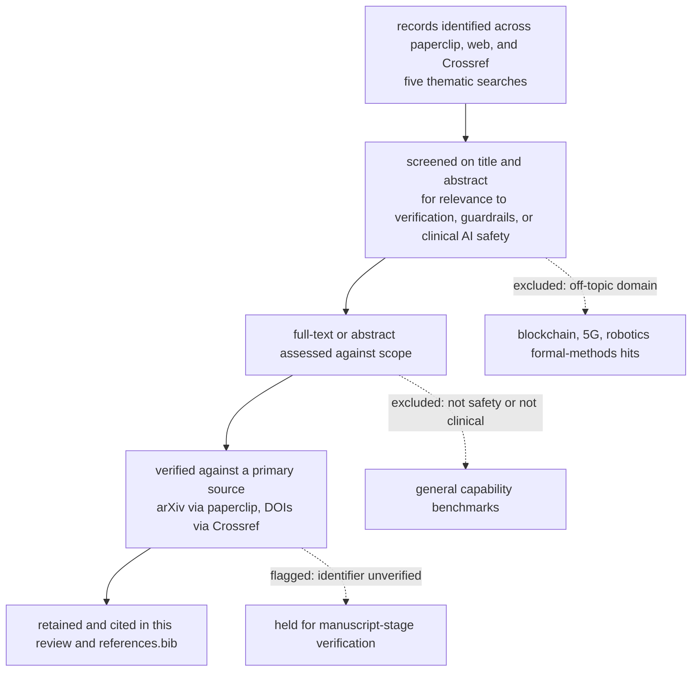

# Literature review: formal verification for clinical AI safety

This review situates the paper in the current literature, with emphasis on 2024-2026 preprints,
and identifies the gap the work fills. Citations key to `references.bib`. Verification of every
entry is in `verification.md`: arXiv preprints were confirmed against the paperclip full-text
corpus, journal and preprint-server identifiers against the Crossref registry. The search date
is 10 June 2026.

## Objectives and scope

The review asks what is established about (a) the theoretical limits of language models that make
guardrail failure a property of the model class, (b) the tractability of verifying neural
networks, (c) the empirical bypassability of probabilistic guardrails, (d) the emerging programme
of formal and verifiable safety layers for language-model agents, and (e) the safety of language
models in clinical decision support. The scope is deliberately cross-disciplinary, spanning
machine-learning theory, formal methods, and clinical informatics, because the paper's argument
joins all three.

## Search strategy

Three complementary corpora were searched: the paperclip full-text index (PubMed Central,
bioRxiv, medRxiv, arXiv, and the US FDA document set), the open web for arXiv and preprint
servers, and the Crossref registry for identifier confirmation. Concept terms were combined
across five themes: formal verification and satisfiability-modulo-theories with language-model or
clinical-AI safety; neurosymbolic clinical decision support; guardrail and jailbreak evaluation;
guaranteed-safe and provably-safe AI; and runtime shielding of AI agents in healthcare. Preprint
servers were included deliberately because the agent-verification literature moves on a
months-long cycle.

## Selection flow

## Thematic synthesis

### Theoretical limits make guardrail failure a class property

A body of results establishes that hallucination and reasoning failure are properties of the
model class rather than engineering debt; these are treated in detail in
`../paper/architectural_limits.md` and summarised in `summaries.md`. The computability argument
[xu2025hallucination], the calibration lower bound [kalai2024calibrated], and the
training-incentive reduction now peer-reviewed in Nature [kalai2026evaluating] are mutually
independent. The circuit-complexity bound on log-precision transformers [merrill2023parallelism]
and its chain-of-thought refinement [merrill2024expressive], together with the empirical decay of
compositional accuracy with depth [dziri2023faith], locate the limit precisely where multi-rule
clinical logic lives. A 2026 systematic review of formal methods for safety-critical machine
learning reaches a consonant conclusion from the verification side, surveying reachability,
satisfiability-modulo-theories, and model checking across forty-six studies and noting the open
problem of scalability [newcomb2026formal].

### Verifying the neural network is intractable at scale

Exact verification of rectified-linear networks is NP-complete [katz2017reluplex], which is why
neural-network verification tools and reachability methods, while sound on small networks, do not
certify a safety-critical decision over the whole input space at frontier scale. This is the
technical premise for relocating safety-critical decisions into a finite symbolic layer.

### Probabilistic guardrails are empirically bypassable

A systematization of jailbreak guardrails reports that no single guardrail is robust across
attack families [wang2025sok], and empirical evasion work drives the detection accuracy of
deployed guardrails down by tens of percentage points [hackett2025bypassing]. Because the widely
deployed guards are themselves learned models, the class-level limits above apply to the guard,
not only to the generator; this is the guard-recursion argument the paper makes explicit.

### A verifiable safety layer for AI agents is an active 2024-2026 programme

The guaranteed-safe AI framework articulates the macro-architecture this paper instantiates: a
world model, a safety specification, and a verifier that emits an auditable proof certificate
[dalrymple2024guaranteed], building on the earlier provably-safe-systems argument
[tegmark2023provably]. In 2025 a wave of systems applied formal and runtime methods to
language-model agents: verified code generation with a runtime monitor [miculicich2025veriguard]
and verifiable safety-policy reasoning for action trajectories [chen2025shieldagent], among
others identified in the search (AgentVerify, AgentGuard, and temporal-constraint enforcement,
held for manuscript-stage verification). These systems share this paper's premise that safety
should live in a verifiable layer, but they target general agent behaviour, are evaluated on
agent-trajectory or code tasks rather than clinical rule sets, and do not run a head-to-head
against probabilistic guardrails on a public clinical benchmark.

### Language models are unsafe in clinical decision support, and guardrails do not resolve it

Clinical evaluations document the failure modes directly. Frontier models are highly vulnerable
to adversarial hallucination in clinical decision support [omar2025adversarial]; healthcare-
specific guardrail work confirms the need and the difficulty [gangavarapu2024healthcare]; and
safety assurance of a clinical AI system has been demonstrated as a discipline in its own right
[festor2022assuring]. A companion retrospective from this group quantifies the central tension:
a four-component probabilistic guardrail stack reduces commission errors but introduces a
safety-critical omission tax of approximately twelve percentage points, which a downstream
verification layer reverses while catching about half of the guardrail-missed omissions and
missing none the guardrails caught [basu2026anchor]. That companion study evaluates the effect of
a verification layer on the language model's natural-language outputs; the present paper is its
formal complement, characterising and measuring the assurance gap on the symbolic control layer
itself and releasing the benchmark on which the measurement is reproducible.

Documented mechanisms from this clinical literature motivate the benchmark's three domains and
are reproduced as synthetic rule-interaction faults rather than copied: co-prescription of a
contraindicated pair such as trimethoprim-sulfamethoxazole with warfarin (the medication domain),
a contraindication whose triggering value is buried in context such as a low estimated glomerular
filtration rate (a lost-in-the-middle pattern), and acuity under-triage (the triage domain).

## Gap and positioning

The literature contains the macro-framework for verifiable safety [dalrymple2024guaranteed], the
intractability result that motivates a symbolic layer [katz2017reluplex], a 2025 wave of
agent-verification systems, and ample evidence that clinical language models are unsafe and that
probabilistic guardrails are bypassable and impose an omission tax. What it does not contain is a
public, named benchmark of clinical safety invariants with independently established ground
truth, a head-to-head measurement of complete verification against probabilistic guardrails on
clinical rule sets, or a characterisation of the detection gap as a function of interaction
depth. The present paper supplies the benchmark (CIV-Bench), the head-to-head, and the
depth-resolved measurement, and positions content-safety guardrails within a tiered assurance
framework rather than misapplying them as property verifiers. The companion retrospective
[basu2026anchor] is the empirical-outcomes complement on language-model outputs; this paper is the
formal-and-benchmark complement on the symbolic layer, and the two are reported separately to
keep the object of study distinct.

## Limitations of this review

The review is narrative and cross-disciplinary rather than an exhaustive systematic review with
dual independent screening; the agent-verification preprint literature is moving quickly and some
identified items are held for manuscript-stage identifier verification before citation; and
preprints, by definition, have not completed peer review and are cited with that caveat.
